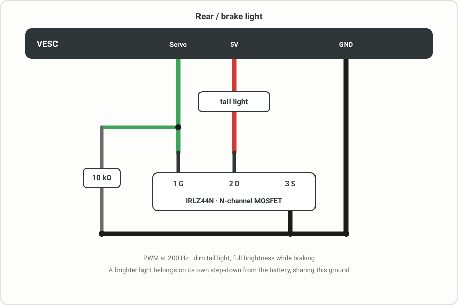

# VESC Scooter Support

Connect a Xiaomi or Ninebot dashboard to a VESC controller. Speed modes, secret modes,
lock with alarm, fully remappable button/lever gestures, cruise control, rear light,
BMS support and a live remote-control dashboard - all configured from a phone-friendly UI
and stored on the ESC.

<!-- fixed width so screenshots render the same size regardless of capture resolution -->

| Control | Modes |
|---------|-------|
|  |  |

| General | General | Setup | Setup |
|---------|---------|-------|-------|
|  |  |  |  |

## ⚠️ Disclaimer

**Use at your own risk.** This is community software provided **as-is, without any warranty**
of any kind, express or implied. It controls a moving vehicle - a bug, misconfiguration, or
hardware fault could cause **loss of motor power, unintended acceleration or braking, or
failure of the lock, alarm, or cruise features**, potentially resulting in a crash, injury,
or damage.

By installing or using this package you accept **full responsibility** for it. The authors
and contributors accept **no liability** for any damage, injury, or loss arising from its use.

- **Test everything on a stand, wheels off the ground, before riding** - especially throttle,
  brake, mode limits, lock/unlock, and cruise control.
- **Cruise control is experimental** - verify the throttle/brake cancel works reliably before
  trusting it, and try it first at low speed on open ground.
- Set your motor current, battery, and temperature limits correctly in VESC Tool; this package
  does not protect your hardware from bad configuration.
- Riding a modified scooter may be illegal on public roads in your jurisdiction and may void
  warranties. Wear appropriate safety gear.

If you don't accept these terms, don't install it.

## Requirements

VESC firmware 7.00, available at https://vesc-project.com/

## Installation

1. Connect to your VESC in VESC Tool and install this package
   (**VESC Packages -> Load Custom -> select the .vescpkg**, or from the package store once listed).
2. **Install the package on every VESC unit.** On dual-motor setups, switch to the second
   unit via **CAN forwarding** and install it there too - each unit runs its own copy.
3. Open the package UI (**Navigation Bar -> App UI**), go to the **Setup** tab and select
   the model **for each unit**:
   - the unit wired to the dashboard gets its dashboard model (**G30**, **M365/1S/PRO2**
     or **G2**),
   - every other unit gets **Slave**.
4. Press **Save** - the script restarts with the chosen model. The model is stored per unit.
5. Configure everything else in the **General**, **Modes** and **Setup** tabs and press **Save**.

**Updating:** just install the new package over the old one - your settings are kept and
migrated automatically. To go back to defaults, use the **Reset** button in the UI.

## What's new in 4.0

- **Ninebot Max G2 dashboard**, selectable as its own model. Its handlebar **horn** sounds
  the dash buzzer, and **holding the turn signal button** for three seconds toggles cruise
  control - the dash drives its own turn signal lamps, so that button is free. **Untested:**
  built from a working reference implementation, but nobody has run it on a G2 yet. Please
  report back if you have one.

- **Stock scooter apps work.** NineDash, m365 Tools and the **official Segway Ninebot app**
  all connect over the dashboard's own BLE module and show live data, and their switches
  control the scooter. No extra hardware, no rewiring - see below.
- **Throttle response improved for everyone**, app or no app. The dashboard sends lever
  data in three different frame types and the package only read one of them; it now reads
  all three, which roughly halves the worst-case delay before a throttle change is applied.
- **App support can be turned off** in Setup, for the sharpest possible throttle.
- **App pairing PIN** - set your own 6-digit code in Setup.
- **Bus logging** in Setup -> Debug prints every frame the dashboard and phone apps send
  to VESC Dev Tools -> Lisp. It applies immediately, is never saved, and always stops at
  the next power on, so it cannot be left on by accident.

## What's new in 3.0

- **Light compensation is now a real calibration.** The headlight sags the throttle/brake
  signal *non-linearly*, so a single offset was never enough - 3.0 fits an affine
  correction (offset + gain) with a guided wizard that measures it for you, light off vs
  on, at the same held lever position. Old flat-offset values can't be converted and are
  reset on upgrade: **re-run the calibration after updating**.
- **Cruise control reworked.** It now only presses and releases the VESC's own cruise
  button - no speed logic of its own. Throttle or brake cancels it instantly and your live
  lever takes over in the same moment, and a new **min/max activation speed** window
  controls when it may engage. It no longer cancels on speed dips, which fixes random
  disengaging on rough roads and with traction control enabled.
- **Cruise moved to the Control tab** as a live toggle button (between Light and Secret).
- **Lever thresholds now come from VESC Tool.** The old *Min Throttle ADC* / *Min Brake ADC*
  fields are gone; gestures, brake light and cruise cancel all use your configured
  **ADC start voltage** instead, so there's one less thing to tune and it matches what the
  motor actually does.
- **Current %** is entered as a percentage and hard capped at 100%, and **Overmodulation**
  is floored at 1.0 - neither can be set to a value that overdrives the motor.
- **mph** now converts every speed-related settings field, not just the dashboard readout.

## Required VESC configuration

The package feeds the throttle and brake from the dashboard into the VESC's ADC app, so a
few controller settings must be set (in VESC Tool, not the package UI):

**On the dashboard unit (master):**

- **App Settings -> General -> App to Use = `ADC`**
- **App Settings -> ADC -> General -> Control Type = `Current No Reverse Brake ADC2`**
- **App Settings -> ADC -> General -> Multiple VESCs Over CAN = `True`** (dual-motor setups)
- Keep **Software ADC** enabled in the package **Setup** tab (default) - the dashboard
  supplies throttle/brake over UART; the package overrides the ADC app inputs.
- For accurate battery % and range, set your pack under
  **Motor Settings -> Additional Info -> Battery**: type, cell count and Ah.

**On every other unit (slave):**

- **App Settings -> General -> App to Use = `No App`** - a running ADC app on the slave
  fights the master's commands and causes stuttering.

**Lever detection (throttle/brake "pressed"):**

- **App Settings -> ADC -> Mapping -> `ADC1 Start voltage` / `ADC2 Start voltage`** define
  where the levers start responding. The package reuses exactly these values to decide when
  a lever counts as pressed - for gestures, the brake light and cruise cancel - so there is
  no separate deadband to configure. Map your levers properly in VESC Tool and everything
  else follows.

**For cruise control (optional):**

- **App Settings -> ADC -> Buttons -> enable `Cruise Control`** (leave it *not* inverted).
  The package uses the VESC's built-in cruise button, so this must be on.

**For the rear / brake light (optional):**

- **App Settings -> General -> enable `Servo Output`**. The light is driven as PWM on the
  SERVO/PPM pin, and that pin stays dead until this is enabled - the package can look
  correctly configured and still produce no light without it.
- Make sure **App to Use** is not `PPM` (or `PPM and UART`), which would claim the same pin
  as an input. With `ADC` (as above) the pin is free to drive the light.

After changing controller settings, write the configuration to each unit and power-cycle.

## Models

One package for everything - the model is stored on the ESC and selected in the UI:

- **G30**: Ninebot G30 dashboard (Ninebot protocol)
- **M365/1S/PRO2**: Xiaomi M365, 1S, Essential and PRO 2 dashboards (Xiaomi protocol)
- **Slave**: secondary ESC in a dual setup - only runs the CAN code server, the master
  pushes the speed mode limits to it

## Features

### Speed modes
- Three speed modes (Eco / Drive / Sport) plus three **secret** modes, each with its own
  speed, current, watts, field weakening and overmodulation factor
- **Current %**: shown and entered as a percentage of your VESC's Motor Current Max, hard
  capped at 100% so it can never scale current above what you've configured
- **Overmodulation**: floored at 1.0 (VESC's own minimum - no overmodulation) so it can't
  be saved below the safe range
- **Per-parameter apply toggles**: each parameter is only written to the motor config when
  its checkbox is enabled - separately for normal and secret modes. Disabled parameters
  never touch your VESC motor settings (e.g. keep your own field weakening setup)
- **Startup mode** selection (Eco / Drive / Sport, applied at boot)

### Gestures
Lock, mode switching, headlight and secret mode activation are all **fully remappable**:

- **Lever combination**: any mix of Brake / Throttle that must be held (or none)
- **Button presses**: 1-5 presses, or **No** - with "No" the gesture fires from the levers
  alone after holding the combination for half a second (no button press at all)
- **Locked**: restrict a gesture so it only works while the scooter is locked
  (e.g. secret mode only unlockable in locked state)
- A lever counts as held once it passes its **ADC start voltage** from VESC Tool (with
  light compensation applied), so there is no separate deadband to tune
- Gestures only react at standstill (configurable button-active speed in Setup)
- Turning the scooter on (single press while off) always works, regardless of the mapping

### Lock & alarm
- Lock mode: motor braked when pushed, alarm with beeping and (optional) siren on
  gyro or wheel movement, configurable thresholds and volume
- Optional "disable secret when locked"

### Cruise control (experimental)
- Hold a steady speed with the throttle for the configured delay (default 5 s, deviation
  window configurable); release the throttle and the scooter keeps that speed
- **Min / max activation speed**: cruise only arms inside this speed window, so it can't
  engage while crawling or above a speed you don't want it at (defaults 5 - 100 km/h)
- Built on the VESC's native cruise function - the package only presses and releases the
  VESC's own cruise button and never runs a speed loop of its own
- **Cancels on any throttle or brake press** past that channel's ADC start voltage, and
  your live lever position takes over the same instant - no need to release and press
  again to accelerate or brake. Cruise does *not* cancel on speed alone, so traction
  control or a bumpy road can't drop it unexpectedly
- Off by default - **toggle it live from the Control tab** (button between Light and
  Secret), tune delay, deviation and the speed window in Setup. Requires the ADC Cruise
  Control button enabled (see above). Use with care.

### Remote control (Control tab)
- Live dashboard in the app: **speed, battery %, voltage, watts, amps, Wh/km and estimated
  range** (range and Wh/km computed the same way VESC Tool does)
- Buttons: power on/off, lock/unlock (standstill only), headlight, secret toggle, cruise
  control on/off, and mode selection - with live status

### Third-party app support (v4.0)
Scooter apps that talk to the dashboard over BLE now see live data and can control the
scooter. Tested on a G30 with **NineDash**, **m365 Tools** and the **official Segway
Ninebot app**, including pairing. The dash BLE module bridges their frames onto the same
UART the package already listens on, so no extra hardware or wiring is needed.

- **Live data**: speed, battery %, voltage, current, power, temperature, odometer, trip
  distance and time, average speed, estimated range, error and alarm codes
- **Controls from the app**: lock / unlock, headlight, rear light, cruise control, speed
  mode (Eco / Drive / Sport), secret mode, buzzer, and "find my scooter". The app's
  *Back light* switch toggles the always-on tail light (needs the rear light output
  enabled in Setup)
- **Battery data**: on Xiaomi the BMS is emulated too, so the app's battery screen is
  populated - pack voltage and current from the VESC (CAN-combined), and per-cell voltage
  derived from pack voltage ÷ series count when no VESC BMS is present
- **App pairing PIN**: set your own 6-digit code in Setup
- **App support** can be turned off in **Setup -> Miscellaneous** (the switch is named
  after your dashboard's brand). Leave it on to use the app; turn it off for the sharpest
  possible throttle response - see the note below
- Reports firmware version **7.0.0** and a serial number of `VESC` + ten digits derived
  from your controller's UUID, so app authors can detect a VESC and adapt (e.g. hide
  unsupported functions) - see [notes for the NineDash developer](docs/ninedash.md)
- Apps have no headlight, secret or speed-mode controls, so three of theirs are borrowed:
  **Recovery mode (KERS)** selects the speed mode (Weak/Medium/Strong = Eco/Drive/Sport),
  **Walk mode** toggles secret modes, and **Direct power control** toggles the headlight
- Lock and unlock are only accepted at standstill, as on a stock scooter
- **Shutdown is deliberately ignored**: it would cut power to the dashboard itself. The
  command is acknowledged so the app doesn't hang, but nothing happens
- Regenerative braking level (KERS) is reported as off - VESC does not use Xiaomi's levels

**Throttle response with an app connected.** The dashboard bus is a single wire shared by
the dash, its BLE module and the controller. Every time the controller transmits, the VESC
firmware switches its receiver off and hands the job of switching it back on to a
background worker without waiting for it - so lever frames arriving in that window are
lost. How much this matters depends entirely on **how often the app polls**, not on how
much data it asks for. Measured on a G30 while riding:

| app | requests/s | controller transmissions/s |
|---|---|---|
| none | - | 9.9 |
| Segway Ninebot (official) | 3.4 | 9.7 |
| m365 Tools | 5.2 | 10.2 |
| NineDash | 10.5 - 11.7 | 14.7 - 15.4 |

Apps that pace their requests at least 100 ms apart cost nothing at all - throttle feels
exactly as it does with no app. NineDash currently polls every dash cycle and that is felt
as occasional throttle and brake lag. If it affects you, turn app support off in
Setup and use the app when parked. The full analysis is in
[notes for the NineDash developer](docs/ninedash.md).

### Comfort
- **Auto headlight**: turn the headlight on automatically at power on
- **Rear / brake light** on the servo pin (MOSFET driver): dim tail light following the
  headlight (or always on), full or blinking brake light while braking. As on a stock
  scooter the tail light is lit whenever the headlight is on, so the always-on option -
  and the app's *Back light* switch - only make a visible difference with the headlight off
- **Battery % at idle** on the dashboard, separately configurable for normal and secret modes
- **BMS battery %**: if a VESC BMS reports, its SOC is used as the battery percentage,
  with a temperature warning above 50 °C or below 0 °C
- **Light compensation**: the headlight sags throttle/brake voltage non-linearly across
  the lever range (not by a fixed amount), so this applies an affine correction
  (offset + gain) rather than a flat offset. A guided **calibration wizard** in Setup
  does this automatically - one button per channel, two held lever positions:
  1. *"Keep throttle released"* (3 s to get into position), then the light is toggled
     **off / on / off / on** and sampled at each state, showing `Measuring... n/8`
  2. *"Press throttle to maximum"* (3 s), then the same off/on/off/on sampling again

  Because the light-off and light-on readings at each position come from the **same
  uninterrupted hold**, the lever is never repositioned between a pair - the only thing
  that changes is the light. Alternating twice per position averages out slow drift
  (pack sag, thermal), and a short settle after each toggle skips the headlight inrush.

  The motor stays disengaged for the whole sequence, so pressing the levers fully never
  moves the scooter - **no stand needed** - and output stays disengaged for a few seconds
  after the last measurement so the lever can be released before normal control resumes.
  Values can also be entered directly.
- **mph display**: dash speed and all speed-related settings switchable between km/h and
  mph (stored internally as km/h; rounded properly for the dash)
- Motor start speed (kick-start) and temperature warning icon with configurable thresholds
- Long button press turns the Dashboard off (not the VESC itself)

### Robustness
- Throttle watchdog: throttle and brake are released if the dashboard link drops mid-ride
- Hardened UART frame parsing and supervised reader threads
- Script runs from flash (low RAM/CPU); settings stored on the ESC with versioned,
  automatic migrations between releases

## Wiring

Red to 5V \
Black to GND \
Yellow to TX (UART-HDX) \
Green to RX (Button) \
1k Ohm Resistor from 3.3V to RX (Button)

### Parts for the dash connection

| Qty | Part |
|---|---|
| 1 | Capacitor 220 µF, 25 V, low ESR, 105 °C, electrolytic, THT, ±20% |
| 1 | Capacitor 1 µF, 50 V, X7R, ceramic, THT, ±10% |
| 1 | Resistor 1 kΩ, 0.25 W, THT |
| 1 | Clip-on ferrite, 5 mm inner diameter - *optional* |

Both capacitors go **across 5V and GND**, as close to the dashboard as the wiring
allows - the electrolytic is the reservoir for current spikes, the ceramic
handles the fast edges. The electrolytic is polarised: its **marked leg is the
minus and goes to GND**, getting that backwards will destroy it. The ferrite
clips over the whole bundle anywhere along its length.

> **Check your 5V budget first.** The dashboard is powered from the VESC's 5V
> output, and if you also add the rear/brake light (and/or a headlight) that all
> draws from the same rail. VESC 5V regulators are small - often only a few
> hundred mA. Add up the current draw of everything you connect and compare it
> to your controller's 5V rating (check its datasheet). If it's marginal or over,
> **don't overload the VESC 5V - use a separate step-down (buck) converter from
> the main battery** to power the lights (and/or dashboard) instead, sharing a
> common ground with the VESC. Overloading the 5V rail can brown out the
> dashboard mid-ride or damage the regulator.

### Rear / brake light (optional)

The rear light is driven from the **servo/PPM pin** through an N-channel MOSFET
(PWM at 200 Hz - dim tail light, full brightness brake light).
Wiring by [Zodiak1993](https://github.com/Zodiak1993/vesc_m365_dash).

Three things must all be set or the light stays dark:

1. **VESC Tool -> App Settings -> General -> `Servo Output` = enabled** (the pin is dead
   without it - see [Required VESC configuration](#required-vesc-configuration))
2. **Setup tab -> `Tail Light Output`** - the master switch for the feature
3. **Setup tab -> `Always ON Tail light`** - only if you want the tail light lit
   independently of the headlight (otherwise it follows the headlight)

Power the LED strip from a source that can supply it (see the 5V note above) - a
higher-current light should run from a step-down module off the battery, not the
VESC 5V:

**Which leg is which.** Hold the MOSFET with the printed face towards you and the
legs pointing down:

| Leg | | Connects to |
|---|---|---|
| 1 - left | Gate | servo output, plus the 10 kΩ down to GND |
| 2 - middle | Drain | the tail light's negative wire |
| 3 - right | Source | GND |

The metal tab is internally connected to leg 2 (Drain), so treat it as live and
don't let it touch anything.

## Tested Hardware

### BLE Displays
- Clone M365 PRO Dashboard ([AliExpress](https://s.click.aliexpress.com/e/_9JHFDN))
- Original DE-Edition PRO 2 Dashboard
- Original DE-Edition G30 Dashboard

### Known Compatible VESCs
- Spintend (Reliable & High Performance):
    - [Ubox Single Lite 100V 100A](https://spintend.com/collections/esc-based-on-vesc/products/single-ubox-aluminum-controller-100v-100a-based-on-vesc?ref=1zuna)
    - [Ubox Single 85V 250A V2](https://spintend.com/collections/esc-based-on-vesc/products/single-ubox-aluminum-controller-85v-250a-v2-based-on-vesc?ref=1zuna)
    - Dual Ubox Alu Lite 100V 100A (dual-motor setup, master + slave)

- Makerbase:
    - [Makerbase VESC 60100HP V2 60V 100A](https://s.click.aliexpress.com/e/_c4N2B2WD)
    - [Makerbase VESC 84100HP 84V 100A](https://de.aliexpress.com/item/1005006515708671.html?pdp_npi=4%40dis%21EUR%21%E2%82%AC+164%2C35%21%E2%82%AC+90%2C39%21%21%21186.38%21102.51%21%400b88abba17794626397951757e0f1c%2112000037495490277%21sh%21DE%212612418744%21X&spm=a2g0o.store_pc_allItems_or_groupList.new_all_items_2007473458239.1005006515708671&gatewayAdapt=glo2deu)
    - [Makerbase VESC 84200HP 84V 200A](https://s.click.aliexpress.com/e/_c4EFhPk1)

- 75100 Alu PCB (Not recommended):
    - [Makerbase 75100 Alu PCB](https://s.click.aliexpress.com/e/_DE9TKAl)
    - [Flipsky 75100 Alu PCB](https://s.click.aliexpress.com/e/_DEXNhX3)

- More recommended VESCs:
    - [MP2 300A 100V/150V VESC](https://github.com/badgineer/MP2-ESC)
    - and many more - use whatever you like.

## Thanks

- **Izuna, AKA13 and Netzpfuscher** - the original VESC dashboard scripts this package
  builds on
- **[Zodiak1993](https://github.com/Zodiak1993/vesc_m365_dash)** - rear/brake light wiring
  and the BMS, overmodulation and cruise-control ideas
- **[Benjamin Vedder](https://github.com/vedderb)** - VESC, VESC Tool, LispBM and the
  CAN code-server library
- **[Koxx3](https://github.com/Koxx3/SmartESC_STM32_v2)** - reference work for Xiaomi ESCs
- The **rollerplausch.com** community for guides and testing

## See Also

https://github.com/Koxx3/SmartESC_STM32_v2 (VESC firmware for Xiaomi ESCs)
