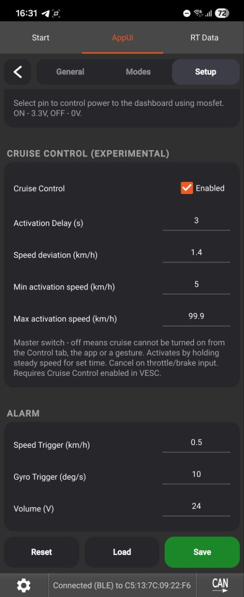
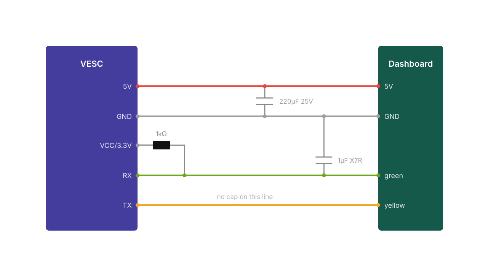

# VESC Scooter Support

Connect a Xiaomi or Ninebot dashboard to a VESC controller. Speed modes, secret modes,
lock with alarm, fully remappable button/lever gestures, cruise control, rear light,
BMS support and a live remote-control dashboard - all configured from a phone-friendly UI
and stored on the ESC.

<!-- fixed width so screenshots render the same size regardless of capture resolution -->

| Control | Modes |
|---------|-------|
|  |  |

| General | General |
|---------|---------|
|  |  |

| Setup | Setup | Setup |
|-------|-------|-------|
|  |  |  |

## ⚠️ Disclaimer

**Use at your own risk.** This is community software provided **as-is, without any warranty**
of any kind, express or implied. It controls a moving vehicle - a bug, misconfiguration, or
hardware fault could cause **loss of motor power, unintended acceleration or braking, or
failure of the lock, alarm, or cruise features**, potentially resulting in a crash, injury,
or damage.

By installing or using this package you accept **full responsibility** for it. The authors
and contributors accept **no liability** for any damage, injury, or loss arising from its use.

- **Test everything on a stand, wheels off the ground, before riding** - especially throttle,
  brake, mode limits, lock/unlock, and cruise control.
- **Cruise control is experimental** - verify the throttle/brake cancel works reliably before
  trusting it, and try it first at low speed on open ground.
- Set your motor current, battery, and temperature limits correctly in VESC Tool; this package
  does not protect your hardware from bad configuration.
- Riding a modified scooter may be illegal on public roads in your jurisdiction and may void
  warranties. Wear appropriate safety gear.

If you don't accept these terms, don't install it.

## Functions

One package for everything - the model is stored on the ESC and selected in the UI:

- **G30** - Ninebot G30 dashboard
- **M365/1S/PRO2** - Xiaomi M365, 1S, Essential and PRO 2 dashboards
- **G2** - Ninebot Max G2 dashboard. **Untested** - no G2 hardware has run it yet
- **Slave** - secondary ESC in a dual setup, only runs the CAN code server

### Speed modes
- Three modes (Eco / Drive / Sport) plus three **secret** modes, each with its own speed,
  current, watts, field weakening and overmodulation
- **Current %** is a percentage of your Motor Current Max, capped at 100%; **Overmodulation**
  is floored at 1.0, so neither can overdrive the motor
- Each parameter has its own apply toggle - unchecked parameters never touch your motor
  config, so you can keep your own field weakening setup
- Selectable startup mode

### Gestures
Lock, mode switching, headlight, secret mode and leaving secret mode are fully remappable:

- **Lever combination** - any mix of Brake / Throttle to hold, or none
- **Button presses** - 1-5, or **No** to fire from the levers alone after half a second
- **Locked** - restrict a gesture to the locked state only
- **Secret OFF** can only ever *leave* secret mode, so it is a way out that cannot turn it
  on by mistake
- A lever counts as held once it passes its ADC start voltage from VESC Tool, so there is no
  separate deadband to tune
- Gestures only react at standstill. Turning the scooter on always works regardless of mapping

### Lock & alarm
- Motor braked when pushed, alarm with beeping and optional siren on gyro or wheel movement
- Configurable thresholds and volume, and an optional "Disable Secret when Locked"

### Cruise control (experimental)
- Hold a steady speed with the throttle for the configured delay and the scooter keeps it
- Built on the VESC's own cruise function - the package only presses and releases the VESC's
  cruise button, so the ADC Cruise Control button must be enabled (see setup below)
- **Cancels on any throttle or brake press** and your live lever takes over the same instant.
  It does not cancel on speed alone, so a bumpy road or traction control cannot drop it
- Arms only inside a configurable **min/max speed window** (default 5 - 100 km/h)
- The Setup switch is a **master switch**: with it off, cruise cannot be turned on from the
  Control tab, an app or a gesture

### Control tab
- Live speed dial with a power sub-dial that scales to the active mode's watt limit, battery
  bar alternating charge and estimated range, and voltage, current, controller and motor
  temperature - the temperatures flash red above the warning thresholds
- Buttons for power, lock/unlock, headlight, secret, cruise and mode selection

### Third-party app support
**NineDash**, **m365 Tools** and the **official Segway Ninebot app** connect over the
dashboard's own BLE module, so no extra hardware or wiring is needed. Tested on a G30,
including pairing.

- **Live data** - speed, battery %, voltage, current, power, temperature, odometer, trip
  distance and time, average speed, range, error and alarm codes
- **Controls** - lock/unlock, headlight, rear light, cruise, speed mode, secret, buzzer and
  "find my scooter". Apps have no headlight, secret or speed-mode control of their own, so
  three of theirs are borrowed: **KERS** selects the speed mode, **Walk mode** toggles
  secret, **Direct power control** toggles the headlight
- **Battery screen** is populated on Xiaomi - the BMS is emulated
- **Shutdown from the app** switches the dashboard off, refused above walking pace
- **App pairing PIN** - set your own 6-digit code in Setup
- Can be turned off in **Setup -> Miscellaneous** for the sharpest possible throttle response
- Protocol details and app pacing measurements:
  [notes for the NineDash developer](docs/ninedash.md)

### Comfort
- **Auto headlight** at power on
- **Rear / brake light** on the servo pin: dim tail light following the headlight (or always
  on), full or blinking brake light while braking
- **Dashboard power control** - **ADC1** or **ADC2** switches the dashboard's supply through
  a MOSFET: **3.3 V on the chosen pin while the scooter is on, 0 V when off**. Needs a
  MOSFET (schematic to follow). Off by default. The pin is detached from the ADC app, so it
  stops working as a lever input - on ADC2 that costs the brake, on ADC1 the throttle,
  unless that lever comes from the dashboard. The UI warns in red when it does
- **Idle display** - while standing still the dash speed readout shows battery %, pack
  voltage, controller or motor temperature instead. Set separately for normal and secret modes
- **BMS battery %** - a reporting VESC BMS supplies the percentage, with a temperature
  warning above 50 °C or below 0 °C
- **Light compensation** - the headlight sags throttle/brake voltage non-linearly, so this
  applies an affine correction (offset + gain) rather than a flat offset. A guided wizard in
  Setup measures it: one button per channel, two held lever positions, the light toggled and
  sampled at each. The motor stays disengaged throughout, so **no stand is needed**. Values
  can also be entered directly. Only offered for channels taken from the dashboard
- **mph** - dash speed and every speed-related setting switch between km/h and mph
- **Ninebot Max G2** - the handlebar **horn** sounds the dash buzzer, and **holding the turn
  signal button** for three seconds toggles cruise control
- Motor start speed (kick-start), temperature warning icon, and a long button press to turn
  the dashboard off

### Robustness
- Throttle watchdog releases throttle and brake if the dashboard link drops mid-ride
- Hardened UART frame parsing and supervised reader threads
- Runs from flash; settings stored on the ESC with versioned automatic migrations

## Requirements

- **VESC firmware 7.00**, from https://vesc-project.com/
- **A VESC controller.** Not every unit works - some have 5V rails too weak for a dashboard,
  and some behave badly on the shared UART. If yours misbehaves, that is worth reporting
- **A supported dashboard** - Xiaomi M365 / 1S / Essential / PRO 2, or Ninebot G30 or Max G2

## Setup

### Install

1. Connect to your VESC in VESC Tool and install this package
   (**VESC Packages -> Load Custom -> select the .vescpkg**, or from the package store once listed).
2. **Install the package on every VESC unit.** On dual-motor setups, switch to the second
   unit via **CAN forwarding** and install it there too - each unit runs its own copy.
3. Open the package UI (**Navigation Bar -> App UI**), go to the **Setup** tab and select
   the model **for each unit**:
   - the unit wired to the dashboard gets its dashboard model (**G30**, **M365/1S/PRO2**
     or **G2**),
   - every other unit gets **Slave**.
4. Press **Save** - the script restarts with the chosen model. The model is stored per unit.
5. Configure everything else in the **General**, **Modes** and **Setup** tabs and press **Save**.

**Updating:** just install the new package over the old one - your settings are kept and
migrated automatically. To go back to defaults, use the **Reset** button in the UI.

### Required VESC configuration

The package feeds the throttle and brake from the dashboard into the VESC's ADC app, so a
few controller settings must be set (in VESC Tool, not the package UI):

**On the dashboard unit (master):**

- **App Settings -> General -> App to Use = `ADC`**
- **App Settings -> ADC -> General -> Control Type = `Current No Reverse Brake ADC2`**
- **App Settings -> ADC -> General -> Multiple VESCs Over CAN = `True`** (dual-motor setups)
- Keep **Software ADC** enabled in the package **Setup** tab (default) - the dashboard
  supplies throttle/brake over UART; the package overrides the ADC app inputs. Throttle
  and brake are switchable separately, so you can take one from the dashboard and leave
  the other on a lever wired to the ADC pin.
- For accurate battery % and range, set your pack under
  **Motor Settings -> Additional Info -> Battery**: type, cell count and Ah.

**On every other unit (slave):**

- **App Settings -> General -> App to Use = `No App`** - a running ADC app on the slave
  fights the master's commands and causes stuttering.

**Lever detection (throttle/brake "pressed"):**

- **App Settings -> ADC -> Mapping -> `ADC1 Start voltage` / `ADC2 Start voltage`** define
  where the levers start responding. The package reuses exactly these values to decide when
  a lever counts as pressed - for gestures, the brake light and cruise cancel - so there is
  no separate deadband to configure. Map your levers properly in VESC Tool and everything
  else follows.

**For cruise control (optional):**

- **App Settings -> ADC -> Buttons -> enable `Cruise Control`** (leave it *not* inverted).
  The package uses the VESC's built-in cruise button, so this must be on.

**For the rear / brake light (optional):**

- **App Settings -> General -> enable `Servo Output`**. The light is driven as PWM on the
  SERVO/PPM pin, and that pin stays dead until this is enabled - the package can look
  correctly configured and still produce no light without it.
- Make sure **App to Use** is not `PPM` (or `PPM and UART`), which would claim the same pin
  as an input. With `ADC` (as above) the pin is free to drive the light.

After changing controller settings, write the configuration to each unit and power-cycle.

### Wiring

| Qty | Part |
|---|---|
| 1 | Capacitor 220 µF, 25 V, low ESR, 105 °C, electrolytic, THT, ±20% |
| 1 | Capacitor 1 µF, 50 V, X7R, ceramic, THT, ±10% |
| 1 | Resistor 1 kΩ, 0.25 W, THT |
| 1 | Clip-on ferrite, 5 mm inner diameter - *optional* |

The **220 µF** goes across **5V and GND** as the reservoir for current spikes, and
the **1 µF** across the **green button line and GND** to keep noise off it. Nothing
goes on the yellow UART line. Fit both as close to the dashboard as the wiring
allows. The electrolytic is polarised: its **marked leg is the minus and goes to
GND**, getting that backwards will destroy it. The ferrite clips over the whole
bundle anywhere along its length.

> **Check your 5V budget first.** The dashboard is powered from the VESC's 5V
> output, and if you also add the rear/brake light (and/or a headlight) that all
> draws from the same rail. VESC 5V regulators are small - often only a few
> hundred mA. Add up everything you connect and compare it to your controller's
> 5V rating. If it's marginal or over, **use a separate step-down (buck) converter
> from the main battery** for the lights (and/or dashboard) instead, sharing a
> common ground with the VESC. Overloading the 5V rail can brown out the
> dashboard mid-ride or damage the regulator.

#### Rear / brake light (optional)

Driven from the **servo/PPM pin** through an N-channel MOSFET (PWM at 200 Hz - dim tail
light, full brightness brake light).
Wiring by [Zodiak1993](https://github.com/Zodiak1993/vesc_m365_dash).

Three things must all be set or the light stays dark:

1. **VESC Tool -> App Settings -> General -> `Servo Output` = enabled**
2. **Setup tab -> `Tail Light Output`** - the master switch. With it off the servo/PPM
   pin is never touched, so it stays free for something else
3. **Setup tab -> `Always ON Tail Light`** - only if you want the tail light lit
   independently of the headlight

Power the LED strip from a source that can supply it (see the 5V note above):

**Which leg is which.** Hold the MOSFET with the printed face towards you and the
legs pointing down:

| Leg | | Connects to |
|---|---|---|
| 1 - left | Gate | servo output, plus the 10 kΩ down to GND |
| 2 - middle | Drain | the tail light's negative wire |
| 3 - right | Source | GND |

The metal tab is internally connected to leg 2 (Drain), so treat it as live and
don't let it touch anything.

## Thanks

- **Izuna, AKA13 and Netzpfuscher** - the original VESC dashboard scripts this package
  builds on
- **[Zodiak1993](https://github.com/Zodiak1993/vesc_m365_dash)** - rear/brake light wiring
  and the BMS, overmodulation and cruise-control ideas
- **[Benjamin Vedder](https://github.com/vedderb)** - VESC, VESC Tool, LispBM and the
  CAN code-server library
- **[Koxx3](https://github.com/Koxx3/SmartESC_STM32_v2)** - reference work for Xiaomi ESCs
- The **scooterhacking.org** community for guides and testing

## See Also

https://github.com/Koxx3/SmartESC_STM32_v2 (VESC firmware for Xiaomi ESCs)
