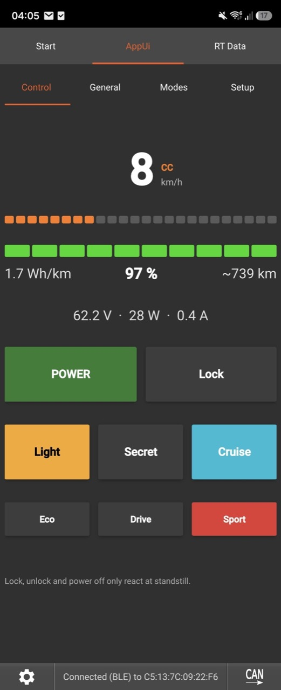
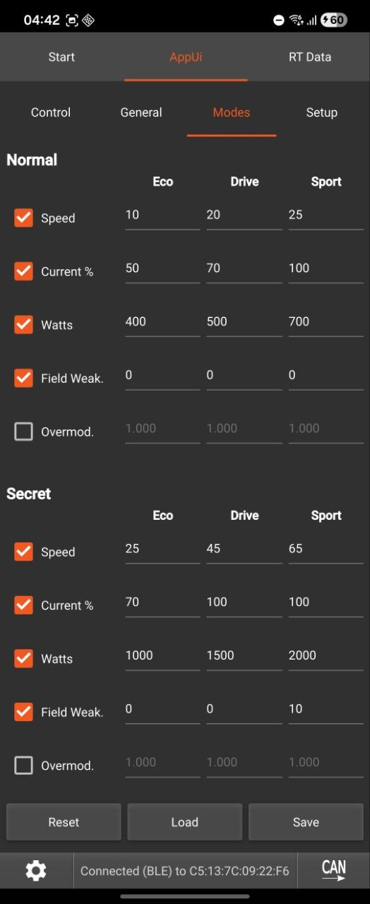
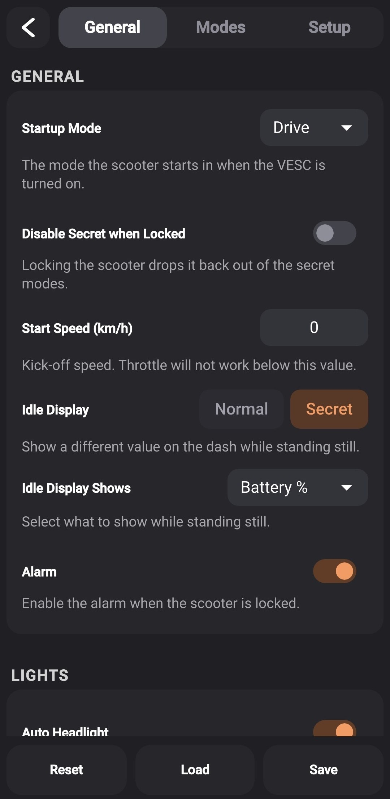
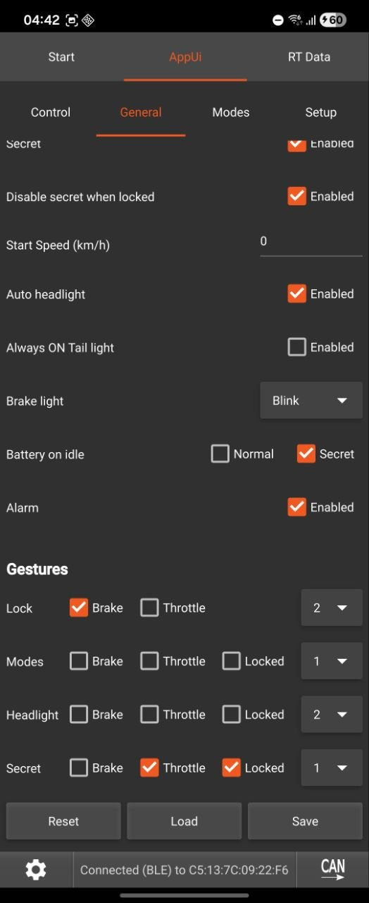
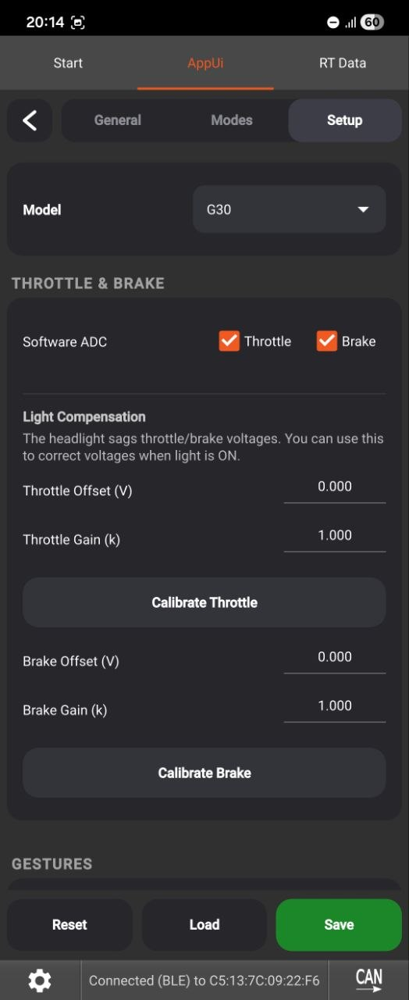
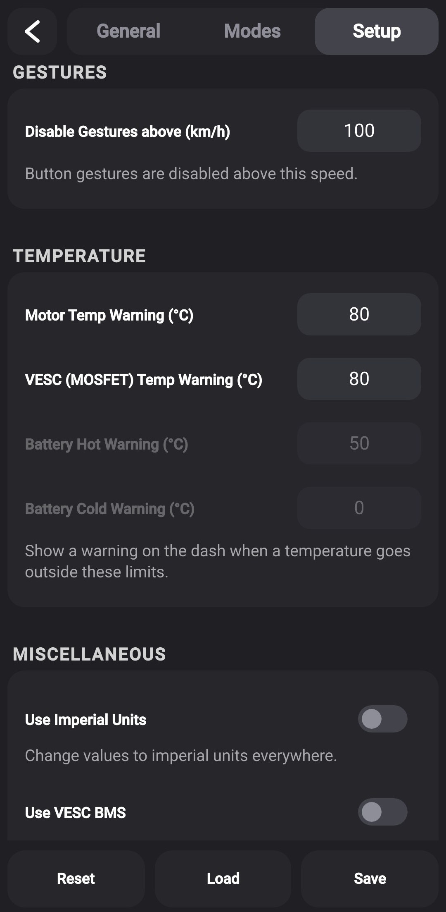
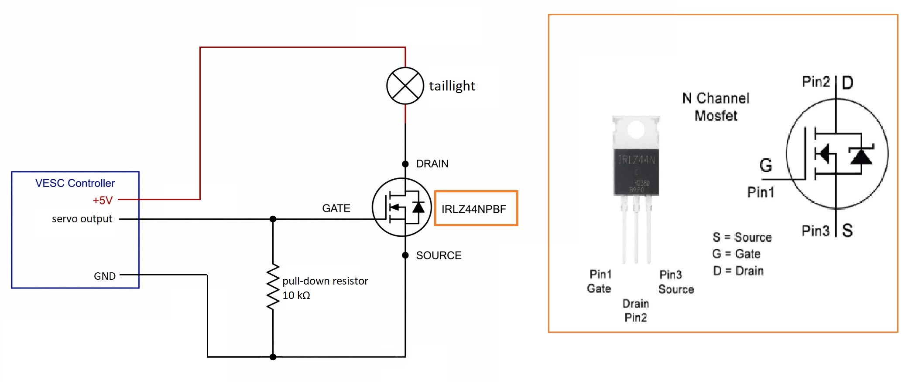

# VESC Scooter Support

Connect a Xiaomi or Ninebot dashboard to a VESC controller. Speed modes, secret modes,
lock with alarm, fully remappable button/lever gestures, cruise control, rear light,
BMS support and a live remote-control dashboard - all configured from a phone-friendly UI
and stored on the ESC.

| Control | Modes |
|---------|-------|
|  |  |

| General | General | Setup | Setup |
|---------|---------|-------|-------|
|  |  |  |  |

## ⚠️ Disclaimer

**Use at your own risk.** This is community software provided **as-is, without any warranty**
of any kind, express or implied. It controls a moving vehicle - a bug, misconfiguration, or
hardware fault could cause **loss of motor power, unintended acceleration or braking, or
failure of the lock, alarm, or cruise features**, potentially resulting in a crash, injury,
or damage.

By installing or using this package you accept **full responsibility** for it. The authors
and contributors accept **no liability** for any damage, injury, or loss arising from its use.

- **Test everything on a stand, wheels off the ground, before riding** - especially throttle,
  brake, mode limits, lock/unlock, and cruise control.
- **Cruise control is experimental** - verify the throttle/brake cancel works reliably before
  trusting it, and try it first at low speed on open ground.
- Set your motor current, battery, and temperature limits correctly in VESC Tool; this package
  does not protect your hardware from bad configuration.
- Riding a modified scooter may be illegal on public roads in your jurisdiction and may void
  warranties. Wear appropriate safety gear.

If you don't accept these terms, don't install it.

## Requirements

VESC firmware 7.00, available at https://vesc-project.com/

## Installation

1. Connect to your VESC in VESC Tool and install this package
   (**VESC Packages -> Load Custom -> select the .vescpkg**, or from the package store once listed).
2. **Install the package on every VESC unit.** On dual-motor setups, switch to the second
   unit via **CAN forwarding** and install it there too - each unit runs its own copy.
3. Open the package UI (**Navigation Bar -> App UI**), go to the **Setup** tab and select
   the model **for each unit**:
   - the unit wired to the dashboard gets its dashboard model (**G30** or **M365/1S/PRO2**),
   - every other unit gets **Slave**.
4. Press **Save** - the script restarts with the chosen model. The model is stored per unit.
5. Configure everything else in the **General**, **Modes** and **Setup** tabs and press **Save**.

**Updating:** just install the new package over the old one - your settings are kept and
migrated automatically. To go back to defaults, use the **Reset** button in the UI.

## Required VESC configuration

The package feeds the throttle and brake from the dashboard into the VESC's ADC app, so a
few controller settings must be set (in VESC Tool, not the package UI):

**On the dashboard unit (master):**

- **App Settings -> General -> App to Use = `ADC`**
- **App Settings -> ADC -> General -> Control Type = `Current No Reverse Brake ADC2`**
- **App Settings -> ADC -> General -> Multiple VESCs Over CAN = `True`** (dual-motor setups)
- Keep **Software ADC** enabled in the package **Setup** tab (default) - the dashboard
  supplies throttle/brake over UART; the package overrides the ADC app inputs.
- For accurate battery % and range, set your pack under
  **Motor Settings -> Additional Info -> Battery**: type, cell count and Ah.

**On every other unit (slave):**

- **App Settings -> General -> App to Use = `No App`** - a running ADC app on the slave
  fights the master's commands and causes stuttering.

**For cruise control (optional):**

- **App Settings -> ADC -> Buttons -> enable `Cruise Control`** (leave it *not* inverted).
  The package uses the VESC's built-in cruise button, so this must be on.

After changing controller settings, write the configuration to each unit.

## Models

One package for everything - the model is stored on the ESC and selected in the UI:

- **G30**: Ninebot G30 dashboard (Ninebot protocol)
- **M365/1S/PRO2**: Xiaomi M365, 1S, Essential and PRO 2 dashboards (Xiaomi protocol)
- **Slave**: secondary ESC in a dual setup - only runs the CAN code server, the master
  pushes the speed mode limits to it

## Features

### Speed modes
- Three speed modes (Eco / Drive / Sport) plus three **secret** modes, each with its own
  speed, current scale, watts, field weakening and overmodulation factor
- **Per-parameter apply toggles**: each parameter is only written to the motor config when
  its checkbox is enabled - separately for normal and secret modes. Disabled parameters
  never touch your VESC motor settings (e.g. keep your own field weakening setup)
- **Startup mode** selection (Eco / Drive / Sport, applied at boot)

### Gestures
Lock, mode switching, headlight and secret mode activation are all **fully remappable**:

- **Lever combination**: any mix of Brake / Throttle that must be held (or none)
- **Button presses**: 1-5 presses, or **No** - with "No" the gesture fires from the levers
  alone after holding the combination for half a second (no button press at all)
- **Locked**: restrict a gesture so it only works while the scooter is locked
  (e.g. secret mode only unlockable in locked state)
- Gestures only react at standstill (configurable button-active speed in Setup)
- Turning the scooter on (single press while off) always works, regardless of the mapping

### Lock & alarm
- Lock mode: motor braked when pushed, alarm with beeping and (optional) siren on
  gyro or wheel movement, configurable thresholds and volume
- Optional "disable secret when locked"

### Cruise control (experimental)
- Hold a steady speed with the throttle for the configured delay (default 5 s, deviation
  window configurable); release the throttle and the scooter keeps that speed
- Built on the VESC's native cruise function, so **any throttle or brake input overrides
  it instantly** at firmware level; a large speed drop or a stop cancels it too
- Off by default - enable in General, tune in Setup. Requires the ADC Cruise Control
  button enabled (see above). Use with care.

### Remote control (Control tab)
- Live dashboard in the app: **speed, battery %, voltage, watts, amps, Wh/km and estimated
  range** (range and Wh/km computed the same way VESC Tool does)
- Buttons: turn the dashboard on/off, lock/unlock (standstill only), headlight,
  mode selection and secret toggle - with live status

### Comfort
- **Auto headlight**: turn the headlight on automatically at power on
- **Rear / brake light** on the servo pin (MOSFET driver): dim tail light following the
  headlight (or always on), full or blinking brake light while braking
- **Battery % at idle** on the dashboard, separately configurable for normal and secret modes
- **BMS battery %**: if a VESC BMS reports, its SOC is used as the battery percentage,
  with a temperature warning above 50 °C or below 0 °C
- **Headlight voltage offset**: compensate a constant throttle/brake ADC shift when the
  headlight (fed from the same 5 V) is on
- **mph display**: dash speed switchable between km/h and mph (rounded properly)
- Motor start speed (kick-start) and temperature warning icon with configurable thresholds
- Long button press turns the Dashboard off (not the VESC itself)

### Robustness
- Throttle watchdog: throttle and brake are released if the dashboard link drops mid-ride
- Hardened UART frame parsing and supervised reader threads
- Script runs from flash (low RAM/CPU); settings stored on the ESC with versioned,
  automatic migrations between releases

## Wiring

Red to 5V \
Black to GND \
Yellow to TX (UART-HDX) \
Green to RX (Button) \
1k Ohm Resistor from 3.3V to RX (Button)

> **Check your 5V budget first.** The dashboard is powered from the VESC's 5V
> output, and if you also add the rear/brake light (and/or a headlight) that all
> draws from the same rail. VESC 5V regulators are small - often only a few
> hundred mA. Add up the current draw of everything you connect and compare it
> to your controller's 5V rating (check its datasheet). If it's marginal or over,
> **don't overload the VESC 5V - use a separate step-down (buck) converter from
> the main battery** to power the lights (and/or dashboard) instead, sharing a
> common ground with the VESC. Overloading the 5V rail can brown out the
> dashboard mid-ride or damage the regulator.

### Rear / brake light (optional)

The rear light is driven from the **servo/PPM pin** through an N-channel MOSFET
(PWM at 200 Hz - dim tail light, full brightness brake light). Enable it in the
**Setup** tab. Wiring by [Zodiak1993](https://github.com/Zodiak1993/vesc_m365_dash).

Power the LED strip from a source that can supply it (see the 5V note above) - a
higher-current light should run from a step-down module off the battery, not the
VESC 5V:

## Tested Hardware

### BLE Displays
- Clone M365 PRO Dashboard ([AliExpress](https://s.click.aliexpress.com/e/_9JHFDN))
- Original DE-Edition PRO 2 Dashboard
- Original DE-Edition G30 Dashboard

### Known Compatible VESCs
- Spintend (Reliable & High Performance):
    - [Ubox Single Lite 100V 100A](https://spintend.com/collections/esc-based-on-vesc/products/single-ubox-aluminum-controller-100v-100a-based-on-vesc?ref=1zuna)
    - [Ubox Single 85V 250A V2](https://spintend.com/collections/esc-based-on-vesc/products/single-ubox-aluminum-controller-85v-250a-v2-based-on-vesc?ref=1zuna)
    - Dual Ubox Alu Lite 100V 100A (dual-motor setup, master + slave)

- Makerbase:
    - [Makerbase VESC 60100HP V2 60V 100A](https://s.click.aliexpress.com/e/_c4N2B2WD)
    - [Makerbase VESC 84100HP 84V 100A](https://de.aliexpress.com/item/1005006515708671.html?pdp_npi=4%40dis%21EUR%21%E2%82%AC+164%2C35%21%E2%82%AC+90%2C39%21%21%21186.38%21102.51%21%400b88abba17794626397951757e0f1c%2112000037495490277%21sh%21DE%212612418744%21X&spm=a2g0o.store_pc_allItems_or_groupList.new_all_items_2007473458239.1005006515708671&gatewayAdapt=glo2deu)
    - [Makerbase VESC 84200HP 84V 200A](https://s.click.aliexpress.com/e/_c4EFhPk1)

- 75100 Alu PCB (Not recommended):
    - [Makerbase 75100 Alu PCB](https://s.click.aliexpress.com/e/_DE9TKAl)
    - [Flipsky 75100 Alu PCB](https://s.click.aliexpress.com/e/_DEXNhX3)

- More recommended VESCs:
    - [MP2 300A 100V/150V VESC](https://github.com/badgineer/MP2-ESC)
    - and many more - use whatever you like.

## Thanks

- **Izuna, AKA13 and Netzpfuscher** - the original VESC dashboard scripts this package
  builds on
- **[Zodiak1993](https://github.com/Zodiak1993/vesc_m365_dash)** - rear/brake light wiring
  and the BMS, overmodulation and cruise-control ideas
- **[Benjamin Vedder](https://github.com/vedderb)** - VESC, VESC Tool, LispBM and the
  CAN code-server library
- **[Koxx3](https://github.com/Koxx3/SmartESC_STM32_v2)** - reference work for Xiaomi ESCs
- The **rollerplausch.com** community for guides and testing

## See Also

https://github.com/Koxx3/SmartESC_STM32_v2 (VESC firmware for Xiaomi ESCs)
